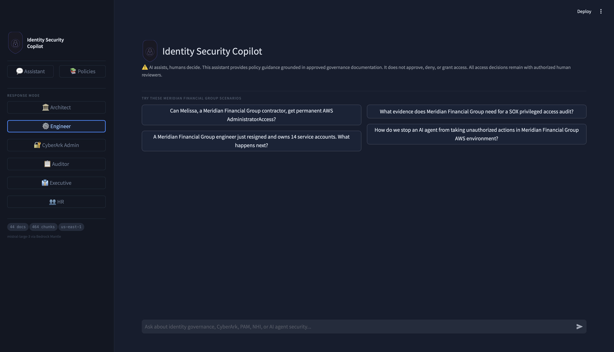
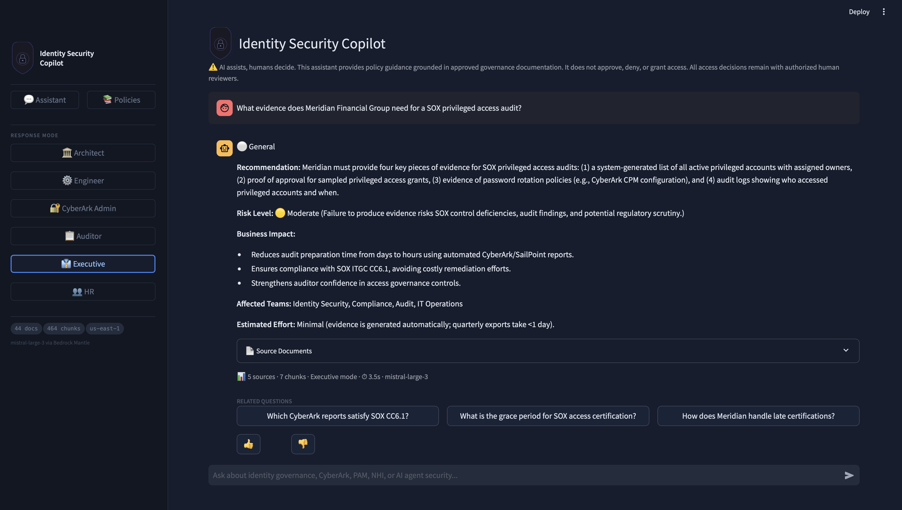

# 🛡️ Identity Security Copilot

> A governance policy service for identity security: a deterministic, policy-grounded reasoning layer that other AI agents, tools, and humans can call to get a citation-backed answer on what an action should or should not be allowed to do. The chat interface below is one way to reach it. The FastAPI and MCP layers (see below) are the way other agents reach it programmatically.

---

## Demo

🎥 **[Watch the Demo Video](#)**

---

## What This Is

Most RAG demos are "upload PDFs, ask questions." This is different.

This project did not start as a chatbot and grow an API as an afterthought. It is built the other way around: a policy reasoning engine with a chat interface as its front door. The same grounded, cited, deterministic-gated reasoning that answers a human's question in Streamlit is exposed as a callable API (FastAPI) and as MCP tools any MCP-compatible client can invoke -- so an agent like the IAM Privilege Drift Agent or the NHI Lifecycle Agent can ask "is this action policy-compliant" and get the same answer a human would, with the same sources and the same refusal to invent policy.

The Identity Security Copilot is a domain-specific governance assistant built for identity security teams at financial services organizations. It answers questions the way a Principal Identity Security Architect would with citations, rationale, and business impact while enforcing the rule that AI assists and humans decide.

**It handles four types of questions:**

| Question Type | Example | Response Style |
|---|---|---|
| Policy & Governance | Can a contractor receive AdministratorAccess? | Recommendation + Why + Standards + Business Impact |
| Architecture & Design | How does HTML5 Gateway fit into CyberArk? | Component flow + trade-offs + migration considerations |
| Troubleshooting | CPM rotation is failing on a Windows domain account | Senior engineer diagnostic steps |
| Compliance & Audit | What evidence is needed for a SOX privileged access review? | Audit artifact checklist with citations |

---

## The Policy Violation Scenario

The strongest demonstration of the tool is what happens when a request violates policy:

> **"Melissa is a contractor customer service manager at Meridian Financial Group requesting permanent AdministratorAccess to the production AWS account. Is this allowed?"**

The assistant:
1. Cites Meridian's internal policy (MFG-IAM-001 §3.2) prohibiting contractor Tier 1 access
2. Cites NIST SP 800-53 AC-6 (Least Privilege) as the authoritative control
3. Explains the Zero Standing Privilege violation
4. Redirects to the authorized human reviewer
5. Never makes the access decision itself

This is governance AI done correctly.

---

## Architecture
**Key architectural decisions:**

- **Local embeddings** (sentence-transformers) no data leaves the machine during indexing
- **Bedrock Mantle** for LLM inference data stays within AWS, satisfies FFIEC data residency requirements for financial services
- **Conversation memory** sliding window of last 6 turns passed to the model; follow-up questions resolve naturally without re-querying
- **Query rewriting** before retrieval, a fast LLM call rewrites follow-up queries into standalone queries using conversation history (coreference resolution)
- **Strict grounding** the model is instructed to return a fallback message when the knowledge base has no relevant content; it never generates policy from training data

---

## Knowledge Base

44 documents · 464 indexed chunks · Last updated June 2026

### Meridian Financial Group (Mock Client Policies)
Fictional financial services company used as a demo client persona. Written in authentic corporate policy voice with real document IDs, approval chains, and regulatory cross-references.

| Document | Policy ID | Coverage |
|---|---|---|
| Privileged Access Management Policy | MFG-IAM-001 v3.2 | Contractor prohibitions, ZSP requirement, approval tiers, dormancy thresholds |
| Cloud Access Policy | MFG-CLD-001 v2.1 | AWS account inventory, JIT provisioning, SCP guardrails, CloudTrail requirements |
| Non-Human Identity Policy | MFG-NHI-001 v1.4 | NHI lifecycle, AI agent governance, mutual oversight pattern, owner departure SLAs |
| Identity Security Incident Response | MFG-INC-001 v2.0 | P1-P4 classification, hardcoded credential playbook, AI agent incident response |

### Enterprise Standards
Privileged Access Standard · Identity Governance Standard · Non-Human Identity Standard · Cloud Access Standard · Break-Glass Standard · Agent Security Standard

### Reference Architectures
PAM Reference Architecture · Enterprise IAM Reference Architecture · Zero Trust Identity Architecture · NHI Lifecycle Architecture · Workload Identity Architecture

### Regulatory Frameworks
NIST SP 800-53 Rev. 5 · NIST SP 800-207 (Zero Trust) · NIST AI RMF · SR 26-02 (Model Risk) · OWASP LLM Top 10 2025

### Vendor Documentation
CyberArk Privilege Cloud · CyberArk Conjur · AWS IAM Identity Center · Okta Lifecycle · Microsoft Entra ID Governance

### Audit Templates
SOX Evidence Template · PCI Access Review Template · Privileged Access Review Checklist · NHI Owner Attestation · Break-Glass Review Form

---

## API and MCP Server

The Copilot's policy reasoning is callable programmatically, not just through the chat UI, via two layers:

**FastAPI wrapper** (`copilot-fastapi`) -- exposes `/v1/policy-query` and `/v1/policy-check` over HTTP, authenticated with a real OAuth 2.1 client-credentials grant (short-lived, HS256-signed Bearer tokens, 5-minute expiry, constant-time secret comparison, rate-limited token issuance). Every registered agent (`iam-drift-agent`, `nhi-lifecycle-agent`, `mcp-server`) exchanges its own client credentials for its own token; no shared static API key.

**MCP server** (`copilot-mcp-server`) -- exposes the same reasoning as two MCP tools, `check_identity_policy` and `check_finding_compliance`, callable by any MCP-compatible client (Claude Desktop, Cursor, VS Code Copilot, or another agent). Every tool call is evaluated against a Cedar policy before the underlying Copilot API is ever reached -- this is a real authorization gate, not a documentation-only claim: unauthorized calls are denied by a fail-closed Policy Enforcement Point before they can reach the knowledge base at all.

Both layers were security-reviewed before this README was written, not after: an injection-risk gap (untrusted retrieved context reaching the model without being marked as data rather than instructions) was found and fixed in the retrieval layer, and a real authentication regression (the MCP server silently falling back to stub responses because its client had not been updated to the OAuth 2.1 flow the API had already moved to) was found and fixed, then proven end-to-end with a live token exchange and a real grounded policy answer.

See the Agentic Trust Framework document for the full design rationale, including the named, honest limitations (single shared identity per MCP client in this phase; network exposure not yet applicable pre-deployment).

## Persona Modes

The assistant adapts its response format based on who is asking:

| Persona | Response Style | Best For |
|---|---|---|
| 🏛️ Architect | Architecture diagrams, component flows, trade-offs, migration considerations | Design reviews, solution architecture |
| ⚙️ Engineer | CLI commands, configuration steps, troubleshooting diagnostics | Implementation, operations |
| 📋 Auditor | Evidence checklists, control citations, compliance mappings | Audit preparation, evidence collection |
| 👔 Executive | One-paragraph summary, risk level, business impact, affected teams | CISO briefings, board reporting |

---

## AI Safety and Governance

This project is governed as an enterprise AI system, not a demo:

- **Answers grounded only in the knowledge base** the model cannot use training data to answer governance questions
- **AI assists, humans decide** the assistant never approves, denies, or grants access
- **Fallback enforcement** when no relevant policy exists, a standard fallback message is returned
- **Feedback logging** thumbs up/down feedback is logged to `feedback_log.jsonl` for model risk monitoring
- **LLM threat mapping** prompt injection, data poisoning and over-reliance are mapped to OWASP LLM Top 10 and NIST AI RMF in `COMPLIANCE.md`
- **Model risk** SR 26-02 places generative AI outside its scope at footnote 3 while directing that an organization's own practices govern what it does not cover; `MODEL_RISK.md` applies its principles on that basis

---

## Technology Stack

| Layer | Technology | Rationale |
|---|---|---|
| Frontend | Streamlit | Rapid enterprise UI; supports multi-page apps |
| Embeddings | sentence-transformers all-MiniLM-L6-v2 | Local execution; no data egress during indexing |
| Vector Store | FAISS IndexFlatIP | Cosine similarity; deterministic; no external dependency |
| LLM | Mistral Large 3 (675B) | Via AWS Bedrock Mantle; data stays within AWS |
| Auth | AWS Secrets Manager + Bearer token | API key stored in Secrets Manager; never hardcoded |
| Infrastructure | AWS (us-east-1) | Satisfies FFIEC data residency for financial services |

---

## Governance Documentation

| Document | Purpose |
|---|---|
| `MODEL_RISK.md` | Model risk controls, with a stated scope boundary against SR 26-02 |
| `COMPLIANCE.md` | Control mapping across NIST 800-53, NIST AI RMF, SOX, PCI DSS, OWASP LLM Top 10, MITRE ATLAS |
| `BUSINESS_CASE.md` | Business case and value narrative |
| `SOURCE_INDEX.md` | Authoritative source index with official URLs |

---

## Roadmap

The following capabilities are planned for v2:

- **IAM Policy Analyzer** paste a JSON IAM policy, receive findings against least-privilege standards and a remediated version
- **Audit Evidence Generator** generate a ready-to-use SOX or PCI evidence package from a natural language request
- **Access Request Evaluator** submit an access request, receive a governance assessment against loaded policies
- **Semantic Chunking** section-boundary chunking for more consistent citations
- **Architecture Generator** generate full CyberArk or AWS IAM architecture specifications from a natural language prompt
- **Hybrid Search** BM25 keyword search combined with vector similarity for improved retrieval of exact policy terms
- **Runtime Correlation Agent** (planned) a lightweight agent correlating CloudWatch logs with vulnerability scan results using this same RAG-grounded reasoning layer -- the dynamic, post-deployment counterpart to Infra Review's static, pre-deployment analysis

---

## Portfolio Context

This project is the governance layer for a three-part identity security AI portfolio:

| Project | Purpose |
|---|---|
| **Identity Security Copilot** (this repo) | Governance assistant and policy enforcement |
| **NHI Lifecycle Automation Agent** | Automated non-human identity lifecycle management |
| **IAM Privilege Drift Detection Agent** | Continuous detection and remediation of IAM privilege drift |

All three projects use AWS Bedrock Mantle for LLM inference and follow the same architectural pattern: deterministic gate, human-in-the-loop for high-risk actions, and audit logging to ServiceNow.

---

## About

**Security Architect @ Go Cloud Architects**

Contact: curtis@igasecurityconsulting.com
